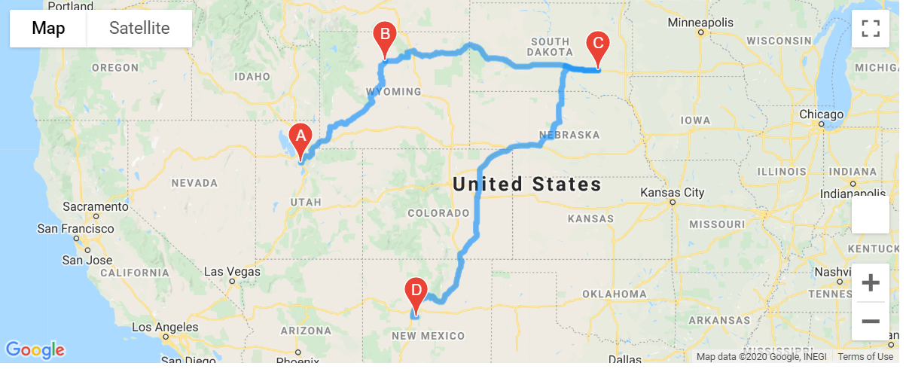

# World_Weather_Analysis

### Background and Results

### Challenge

1. Randomly seelcted about 500 cities using random library for setting  
latitude/longtitude and citypy to locate nearest cities

2. User Open Weather Map to get data weather data for the cities
   - Temperature
   - Humidity
   - Cloudiness
   - Wind Speed
   - Rainfall (3hr)  [divided by 25.4 to get inches]
   - Snowfall (3hr)  [divided by 25.4 to get inches]
   - Weather Description
The data is in WeatherPy_datapase.csv

3. Based on user input on Max/Min temperature and rainfall/snowfall criteria, 
the data was filtered down. the cities with relevant parameters in Weather_vacation.csv

3. Plotted the cities with markers on a google map using Google Platform/Gogle Maps 
Markers showed
   - Hotel Name
   - City
   - Country
   - Current Weather with temperature

4. Selected 4 cities in a continent(USA),[San Jose, Santa Ana,Kerrville, Thompson] and 
used Google Directions API to route through the 4 cities 

5. Grouped the cities to get a marker layer map with pop up marker for the 4 cities

